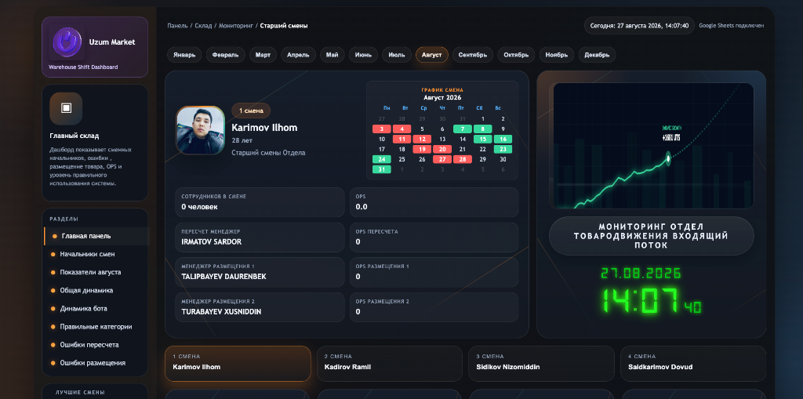
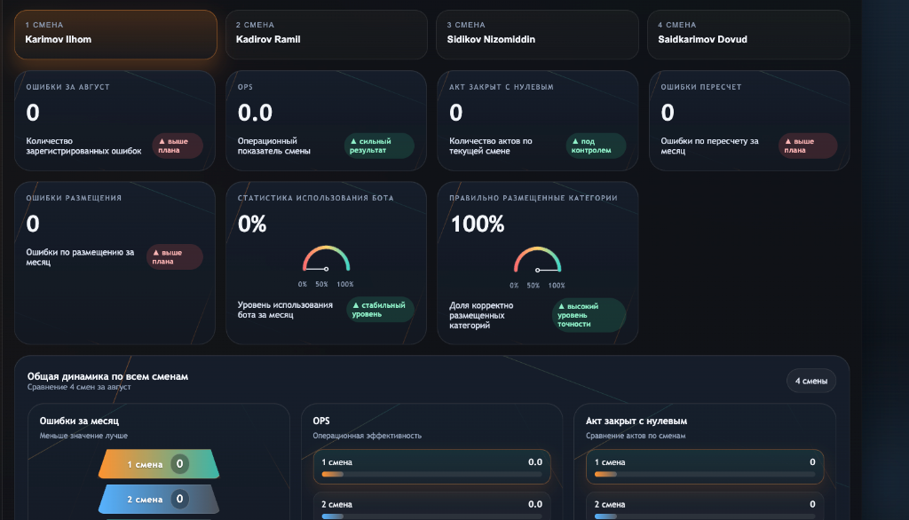
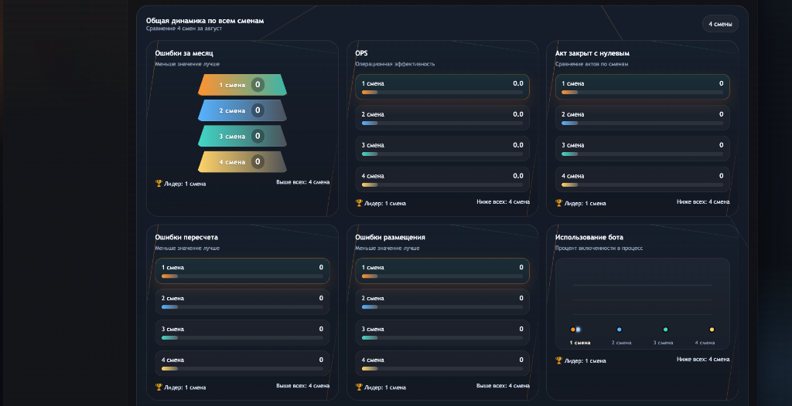
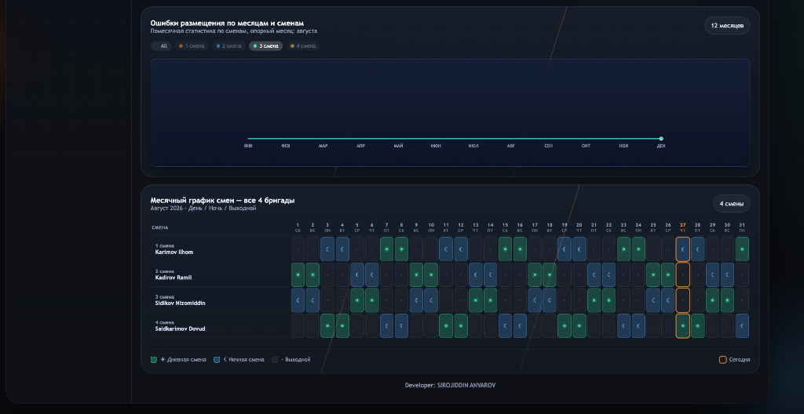

# 🏢 Uzum Market | Складской Дашборд Сменных Начальников (WMS Analytics)
### 📊 Система Мониторинга KPI, Производительности (OPS) и Контроля Качества на Главном Складе

<div align="center">



### 🌐 **[👉 ОТКРЫТЬ LIVE САЙТ: SHIFT-DASHBORD.NETLIFY.APP 👈](https://shift-dashbord.netlify.app/)**

<br/>

[](https://shift-dashbord.netlify.app/)
[](https://github.com/theanvarow/Werehose-Dashbord)
[](https://sheets.google.com)
[](https://developer.mozilla.org/en-US/docs/Web/JavaScript)
[](https://www.chartjs.org/)
[](https://shift-dashbord.netlify.app/)

</div>

---

## 🌐 Ссылка на Рабочий Сайт (Live Website)

> 🚀 **Рабочая система развернута и доступна онлайн:**
> 
> ### 🔗 **[https://shift-dashbord.netlify.app/](https://shift-dashbord.netlify.app/)**

---

## 🎯 Цель Проекта (Project Objective)

**Складской Дашборд Uzum Market (Главный Склад — Отдел Товародвижения / Входящий Поток)** — это высокотехнологичная аналитическая веб-панель в режиме реального времени, разработанная для начальников смен, операционных менеджеров и руководства распределительного центра.

### 📌 Ключевые Задачи:
1. **Оперативный мониторинг 24/7:** Автоматическое отслеживание производительности (OPS) и выполнения планов по всем 4 сменным бригадам (*Бригада 1, 2, 3, 4*).
2. **Контроль и минимизация инцидентов:** Мгновенный учет и локализация ошибок пересчета (*Пересчет*), некорректного размещения по категориям (*Неправильные категории*) и актов с нулевым результатом (*Акт закрыт с нулевым*).
3. **Мотивация и оценка смен (Leaderboard):** Подсчет рейтинга эффективности (Score), определение лучших зон (Best Zone) и персональный фокус каждого начальника смены.
4. **Сквозная синхронизация с Google Таблицами:** Полная интеграция без промежуточных баз данных — оператор вносит данные в Google Sheets, и дашборд мгновенно отображает актуальную аналитику.

---

## 🖼️ Обзор Интерфейса Системы (Visual Interface)

### 1️⃣ Главная Панель и Профиль Руководителя Смены
> Карточка начальника смены (*Karimov Ilhom*), мини-календарь ротации, закрепленные менеджеры пересчета/размещения, индикатор реального времени и статус синхронизации с Google Sheets.

<div align="center">


</div>

---

### 2️⃣ Сводные Показатели KPI и Качество Работы Смены
> Оперативные счетчики: общее количество ошибок, объем OPS, закрытые нулевые акты, ошибки пересчета и размещения, процент использования Telegram/WMS бота и точность категоризации (100%).

<div align="center">



</div>

---

### 3️⃣ Сравнительный Анализ и Общая Динамика по Всем 4 Сменам
> Интерактивное сопоставление 4 бригад: ошибки за месяц, операционная эффективность (OPS), статистика нулевых актов, инциденты пересчета/размещения и вовлеченность в работу с ботом.

<div align="center">



</div>

---

### 4️⃣ Тренды Ошибок Размещения и Месячный График Смен
> Помесячный график динамики ошибок по сменам (12 месяцев) и интерактивный график смен на весь месяц с разметкой дневных смен (☀️), ночных смен (🌙) и выходных дней.

<div align="center">



</div>

---

## ✨ Ключевые Возможности (Core Features)

- 👥 **Персонализированные Профили Сменных Начальников:** Быстрое переключение между 1, 2, 3 и 4 сменами (*Каримов Ильхом, Кадиров Рамиль, Сидиков Низомиддин, Саидкаримов Довуд*).
- 📈 **Интерактивные Графики на Chart.js:** Динамические линии трендов, сравнение показателей в реальном времени, адаптивная подсветка лидеров.
- 📅 **Умный Календарь Ротации:** Наглядное расписание смен на любой выбранный месяц года.
- ⚡ **Google Sheets Cloud Integration:** Автоматический парсинг и расчет KPI прямо из облачной таблицы.
- 🎨 **Dark Glassmorphism UI:** Современный дизайн в стиле темного стекла с неоновыми цветовыми акцентами для удобства круглосуточной работы.

---

## 🏗️ Архитектура и Технологический Стек

| Уровень | Технологии | Назначение |
| :--- | :--- | :--- |
| **Клиентская часть (Frontend)** | `HTML5`, `Vanilla CSS3`, `JavaScript (ES6+)` | Быстрый, реактивный интерфейс без сторонних тяжелых библиотек |
| **Визуализация данных** | `Chart.js v4` | Построение интерактивных графиков, спидометров и диаграмм |
| **Источник данных** | `Google Sheets API / CSV Engine` | Удобная для операторов облачная база данных |
| **Деплой и Хостинг** | `Netlify` & `GitHub Pages` | Мгновенная загрузка и непрерывная доступность |

---

## 📑 Структура Google Таблицы (Data Schema)

Данные передаются через 2 типа строк:
- `shift` — индивидуальные показатели конкретной смены.
- `table` — общая таблица сопоставления и командной аналитики.

```
Ustunlar ro'yxati:
entry_type | month | shift_key | name | role | employees | errors | ops | usage | status |
bestZone | score | monthStatus | focus | recountManager | recountOps | placementManager1/2 |
placementOps1/2 | actClosedZero | recountErrors | placementErrors | botUsageStats | wrongCategoryPlacement
```

---

## 🚀 Локальный Запуск (Quick Start)

```bash
# 1. Клонируйте репозиторий
git clone https://github.com/theanvarow/Werehose-Dashbord.git
cd Werehose-Dashbord

# 2. Запустите локальный сервер
python3 -m http.server 8080

# 3. Откройте в браузере
open http://localhost:8080
```

---

## 👨‍💻 Автор и Контакты (Author)

- **Разработчик:** Сирожиддин Анваров ([@theanvarow](https://github.com/theanvarow))
- **Проект:** Uzum Market Logistics & Warehouse Operations Management
- **Рабочий сайт:** [https://shift-dashbord.netlify.app/](https://shift-dashbord.netlify.app/)
- **Репозиторий:** [https://github.com/theanvarow/Werehose-Dashbord](https://github.com/theanvarow/Werehose-Dashbord)

---

<div align="center">
⭐ Если проект оказался полезным, поставьте <b>Star</b> в репозитории GitHub! ⭐
</div>
