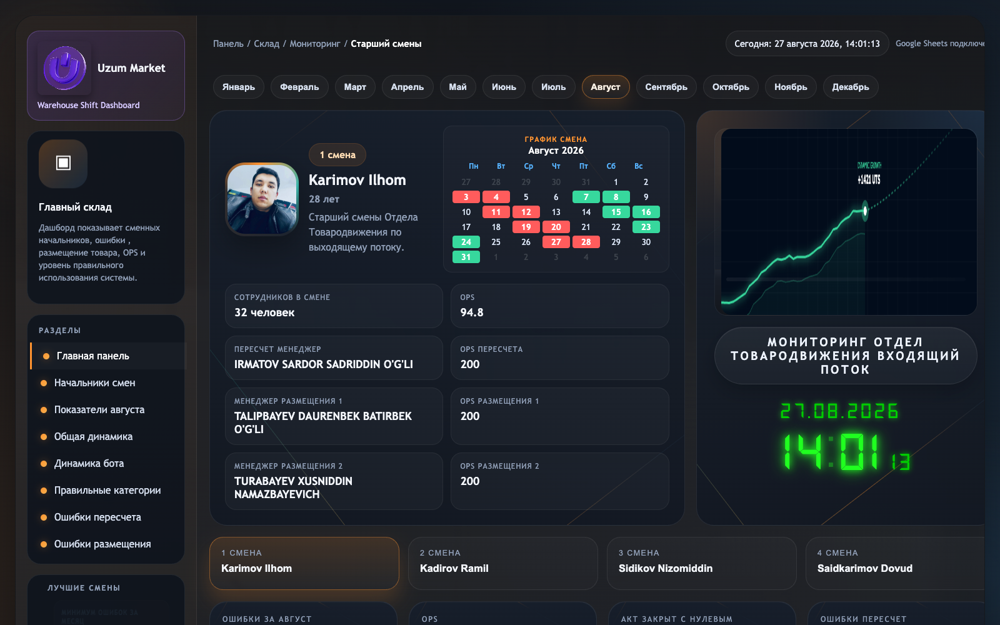
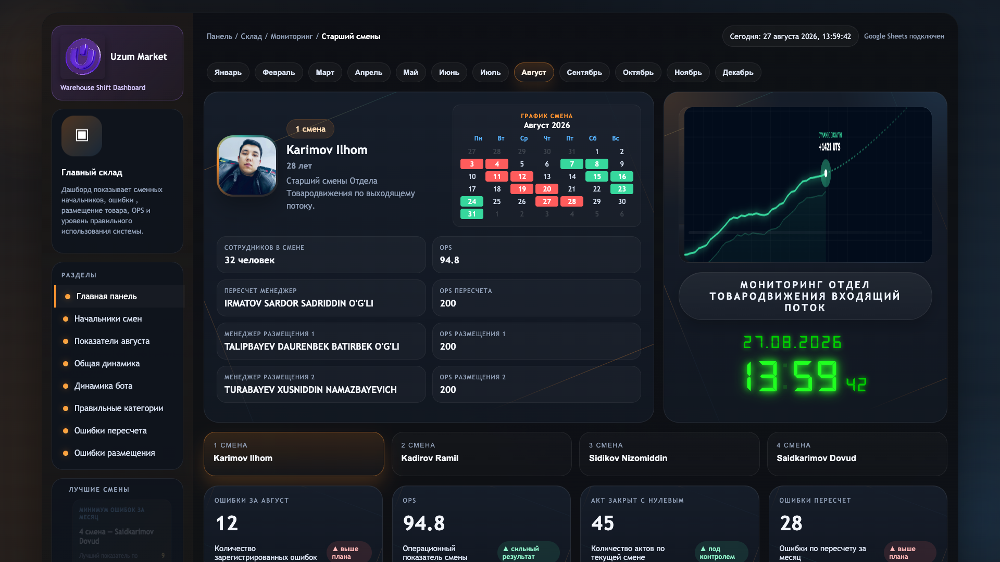

# 🏢 Uzum Market | Warehouse Shift KPI & Analytics Dashboard
### 📊 Omborda Smena Boshliqlari, OPS va Sifat Ko'rsatkichlarini Real-Vaqtda Boshqarish Tizimi

<div align="center">



[](https://theanvarow.github.io/Werehose-Dashbord/)
[](https://github.com/theanvarow/Werehose-Dashbord)
[](https://sheets.google.com)
[](https://developer.mozilla.org/en-US/docs/Web/JavaScript)
[](https://www.chartjs.org/)
[](https://github.com/theanvarow/Werehose-Dashbord)

</div>

---

## 🎯 Loyiha Maqsadi (Project Objective)

**Uzum Market Bosh Ombori (Главный Склад - OTD Kiruvchi Oqim / Входящий Поток)** bo'limida ish unumdorligini oshirish, smena boshliqlari va menejerlar faoliyatini shaffof baholash hamda operatsion xatoliklarni minimallashtirish uchun ishlab chiqilgan interaktiv analitik boshqaruv platformasi.

### 📌 Asosiy Yechiladigan Muammolar:
1. **Real-vaqt monitoringi:** 4 ta ishchi smenaning (Brigada 1, 2, 3, 4) kunlik va oylik ish unumdorligini (OPS) avtomatlashtirilgan tarzda kuzatish.
2. **Xatoliklar nazorati:** Qayta sanash (*Пересчет*), noto'g'ri toifa joylashtirish (*Неправильные категории*) va nollik yopilgan aktlarni (*Акт закрыт с нулевым*) zudlik bilan aniqlash.
3. **KPI va Motivatsiya:** Smena rahbarlarining oylik reytingi, ballari (Score) va asosiy fokus yo'nalishlarini vizual ko'rsatish.
4. **Google Sheets bilan to'g'ridan-to'g'ri integratsiya:** Murakkab backend serversiz to'g'ridan-to'g'ri bulutli jadvaldan ma'lumotlarni sekundiga yangilash.

---

## ✨ Asosiy Imkoniyatlar (Key Features)

### 👥 1. 4 ta Smena Boshliqlari KPI Reytingi & Kartalari
- **Smena Liderlari Profili:** Karimov Ilhom, Nizomiddin, Dovud, Ramil va boshqa smena rahbarlarining jonli statistikasi.
- **KPI Metrikalari:** Xodimlar soni, jami qayta ishlangan birliklar (OPS), xatoliklar soni, tizimdan foydalanish darajasi.
- **Eng yaxshi zona (Best Zone) & Reyting (Score):** Smenaning eng kuchli natija ko'rsatgan sektori va ball bahosi.

### 📈 2. Interaktiv Grafiklar & Vizual Dinamika (Chart.js)
- **Umumiy Dinamika:** Barcha 4 smenaning kunlik/oylik reja va fakt bo'yicha solishtirma grafigi.
- **Botdan Foydalanish Dinamikasi:** Smenalar bo'yicha Telegram/WMS botlaridan foydalanish ko'rsatkichlari (%).
- **To'g'ri/Noto'g'ri Joylashtirish:** Mahsulot toifalarining to'g'ri joylashtirilish nisbati tahlili.
- **Xatoliklar Solishtirmasi:** Qayta sanash (*Recount*) va Joylashtirish (*Placement*) xatolarining oylar kesimidagi dinamikasi.

### 📅 3. Oylik Smena Grafigi va Taqvimi
- 4 ta brigadaning barcha kunlik ish navbatlari va rotatsiya jadvali (Kunduzgi/Tungi smena, dam olish kunlari).
- Har bir smena a'zolari va brigada tarkibining to'liq tahliliy ro'yxati.

### ⚡ 4. Google Sheets Live Sync (Bulutli Sinxronizatsiya)
- Google Sheets API / CSV orqali hech qanday qiyinchiliksiz ma'lumotlarni real-vaqt rejimida yuklash.
- Jadvalga yangi qator kiritilishi bilan dashboard avtomatik tarzda yangi ko'rsatkichlarni hisoblab chiqaradi.

### 🎨 5. Premium Dark UI & Glassmorphism Dizayn
- Zamonaviy qora/to'q ko'k ranglar palitrasi, nozik neon va gradient aksentlar.
- Har qanday qurilma (Katta monitorlar, noutbuklar, planshetlar) uchun to'liq moslashuvchan (Responsive).

---

## 🖼️ Tizim Ko'rinishi (Screenshots Gallery)

<div align="center">

### 🖥️ Asosiy Boshqaruv Paneli (Main Dashboard View)


### 📊 Batafsil To'liq Skrinshot (Full High-Resolution Overview)


</div>

---

## 🏗️ Texnologiyalar Staki (Tech Stack)

| Qatlam | Texnologiya | Tavsif |
| :--- | :--- | :--- |
| **Frontend** | `HTML5`, `CSS3 (Vanilla)`, `JavaScript (ES6+)` | Tezkor, yengil va mustaqil mijoz tomoni arxitekturasi |
| **Vizualizatsiya** | `Chart.js v4` | Interaktiv bar, line va dinamik analitik grafiklar |
| **Ma'lumotlar Bazasi** | `Google Sheets API / CSV Engine` | Oddiy va qulay bulutli ma'lumotlar boshqaruvi |
| **Dizayn Uslubi** | `Dark Mode Glassmorphism` | Professional omborxona terminallari uchun ko'zga qulay dizayn |

---

## 📑 Google Sheets Ma'lumotlar Strukturasi (Data Schema)

Jadval ma'lumotlari 2 xil formatdagi qatorlar orqali to'ldiriladi:

```
1. shift  -> 4 ta smena boshliqlari KPI ma'lumotlari uchun
2. table  -> Umumiy smenalar tahlili va katta hisobot jadvali uchun
```

### 📋 Asosiy Ustunlar Tavsifi:

| Ustun Nomi | Turi | Tavsif |
| :--- | :--- | :--- |
| `entry_type` | `String` | Qator turi: `shift` yoki `table` |
| `month` | `String` | Hisobot oyi (masalan: `yanvar`, `fevral`, `mart`, `aprel`) |
| `shift_key` | `String` | Smena identifikatori: `shift1`, `shift2`, `shift3`, `shift4` |
| `name` / `leader_name` | `String` | Smena boshlig'i F.I.O. (masalan: `Karimov Ilhom`) |
| `employees` | `Number` | Smenadagi xodimlar soni |
| `ops` / `fact_ops` | `Number` | Bajarilgan jami operatsiyalar (OPS soni) |
| `errors` / `fact_errors` | `Number` | Jami qayd etilgan xatoliklar soni |
| `recountManager` | `String` | Qayta sanash (*Пересчет*) menejeri F.I.O. |
| `recountOps` | `Number` | Qayta sanash bo'yicha bajarilgan operatsiyalar |
| `placementManager1/2` | `String` | Joylashtirish (*Размещение*) menejerlari |
| `placementOps1/2` | `Number` | Joylashtirish bo'yicha OPS ko'rsatkichlari |
| `actClosedZero` | `Number` | Nollik yopilgan aktlar soni (*Акт закрыт с нулевым*) |
| `recountErrors` | `Number` | Qayta sanashdagi xatolar soni |
| `placementErrors` | `Number` | Joylashtirishdagi xatolar soni |
| `botUsageStats` | `Percentage` | Telegram/WMS botidan foydalanish foizi (%) |
| `wrongCategoryPlacement` | `Percentage` | Noto'g'ri toifaga joylashtirilgan tovarlar foizi (%) |

---

## 🚀 Ishga Tushirish va O'rnatish (Quick Start)

### 1. Repozitoriyani klonlash:
```bash
git clone https://github.com/theanvarow/Werehose-Dashbord.git
cd Werehose-Dashbord
```

### 2. Mahalliy kompyuterda ochish:
Loyihani ishga tushirish uchun hech qanday murakkab server o'rnatish talab etilmaydi. Shunchaki `index.html` faylini istalgan brauzerda oching yoki local server orqali ishga tushiring:

```bash
# Python orqali:
python3 -m http.server 8080

# Yoki Node.js (npx serve) orqali:
npx serve .
```

Brauzerda oching: `http://localhost:8080`

---

## 📁 Loyiha Tuzilishi (Directory Structure)

```plaintext
Werehose-Dashbord/
├── index.html                  # Asosiy dashboard sahifasi va barcha UI mantiqi
├── google_sheets_template.csv  # Google Sheets uchun andoza jadval
├── GOOGLE_SHEETS_USTUNLAR.txt  # Jadval ustunlari va to'ldirish qo'llanmasi
├── image/                      # Smena rahbarlari rasmlari, logotiplar va skrinshotlar
│   ├── big-logo.webp           # Uzum Market logotipi
│   ├── dashboard_preview.png   # Dashboard asosiy skrinshoti
│   ├── dashboard_full.png      # To'liq ekran skrinshoti
│   ├── Ilhom.jpg               # Smena 1 rahbari
│   ├── Nizim.jpg               # Smena 2 rahbari
│   ├── dovud.png               # Smena 3 rahbari
│   └── ramil.jpg               # Smena 4 rahbari
└── README.md                   # Loyiha hujjatlari va qo'llanma
```

---

## 👨‍💻 Muallif va Bog'lanish (Author)

- **Muallif:** Sirojiddin Anvarov ([@theanvarow](https://github.com/theanvarow))
- **Loyiha:** Uzum Market Logistics & Warehouse Operations Management
- **GitHub:** [https://github.com/theanvarow](https://github.com/theanvarow)

---

<div align="center">
⭐ Agar ushbu loyiha sizga ma'qul kelgan bo'lsa, GitHub'da <b>Star</b> bosishni unutmang! ⭐
</div>
